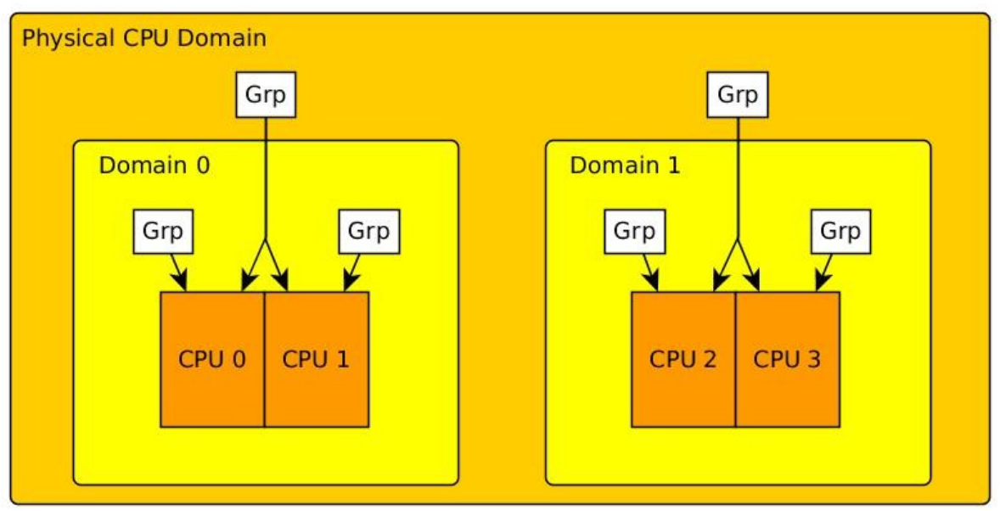

# Linux 进程调度

本文译自爱丁堡大学 Volker Seeker 的 *Process Scheduling in Linux*，讲 Linux 内核怎样做任务调度。覆盖通用调度框架、调度类、公平调度、软实时调度，以及公平调度与实时调度各自的负载均衡。

结构仍按 Seeker 的笔记来。文中的代码、路径和结构体已经改成 **Linux 6.6.0**，对应本目录下的 `linux-6.6/`。英文原稿 `Process_Scheduling_in_Linux.md` 仍是 3.1 时代的原文，只作对照，不要拿它去对 6.6 源码。

6.6 里调度代码不在单独一个 `kernel/sched.c` 里，拆开了：

| 你要打开的文件 | 里面是什么 |
| --- | --- |
| `linux-6.6/kernel/sched/core.c` | 框架：`schedule()`、`scheduler_tick()`、`try_to_wake_up()` |
| `linux-6.6/kernel/sched/fair.c` | 普通任务：公平调度类（6.6 用 EEVDF） |
| `linux-6.6/kernel/sched/rt.c` | 软实时：`SCHED_FIFO` / `SCHED_RR` |
| `linux-6.6/kernel/sched/deadline.c` | `SCHED_DEADLINE`（比 RT 更高的一类） |
| `linux-6.6/kernel/sched/idle.c` | 空闲任务 |
| `linux-6.6/kernel/sched/stop_task.c` | 停止任务 |
| `linux-6.6/kernel/sched/sched.h` | 内部定义：`struct rq`、`cfs_rq`、`sched_class` |
| `linux-6.6/include/linux/sched.h` | `task_struct`、`sched_entity` |
| `linux-6.6/Documentation/scheduler/` | 调度文档 |

正文里的代码会删掉和当前主题无关的分支，方便对着源码读；行号会随小版本变化，以函数名为准。

## 术语对照

文中关键概念第一次出现时会标英文名。这里再集中列一份，方便对照源码和英文资料。

| 中文 | 英文 |
| --- | --- |
| 进程调度 / 进程调度器 | process scheduling / process scheduler |
| 任务 | task（本文里指被调度的线程） |
| 进程 / 线程 | process / thread |
| 线程组 ID | thread group ID, TGID |
| 任务描述符 | `task_struct` |
| CPU 密集型 / I/O 密集型 | CPU-bound / I/O-bound |
| 实时任务 / 普通任务 | real-time (RT) task / normal task |
| 优先级 / nice 值 | priority / nice value |
| 调度类 / 调度策略 | scheduling class / scheduling policy |
| 调度框架 | scheduler skeleton |
| 运行队列 | runqueue |
| 抢占 | preemption |
| 上下文切换 | context switch |
| 需要重新调度标志 | `need_resched` |
| 完全公平调度器 | Completely Fair Scheduler, CFS（2008–2023 的公平类算法） |
| EEVDF | Earliest Eligible Virtual Deadline First（6.6 公平类用的算法） |
| 虚拟运行时 | virtual runtime, `vruntime` |
| 虚拟截止时间 | virtual deadline, `deadline` |
| 基础时间片 | base slice，`sysctl_sched_base_slice` |
| `SCHED_DEADLINE` | deadline 调度类，排在实时类前面 |
| 红黑树 | red-black tree |
| 公平组调度 | fair group scheduling |
| 调度实体 | scheduling entity, `sched_entity` |
| 软实时 | soft real-time |
| FIFO / 时间片轮转 | `SCHED_FIFO` / `SCHED_RR` (round robin) |
| 实时节流 / 带宽 | real-time throttling / bandwidth |
| 对称多处理 | SMP (symmetric multiprocessing) |
| 非统一内存访问 | NUMA |
| 负载均衡 | load balancing |
| 调度域 / 调度组 | scheduling domain / scheduling group |
| 缓存亲和性 | cache affinity |
| 超线程 | hyper-threading |
| 主动均衡 / 空闲均衡 | active balancing / idle balancing |
| 根域 | root domain |
| CPU 优先级 | CPU priority, `cpupri` |
| 推送 / 拉取 | push / pull |

## 目录

1. [进程调度](#1-进程调度)
2. [任务分类](#2-任务分类)
3. [调度类](#3-调度类)
4. [主运行队列](#4-主运行队列)
5. [调度框架](#5-调度框架)
6. [调度算法简史](#6-调度算法简史)
7. [公平调度（CFS 与 EEVDF）](#7-公平调度cfs-与-eevdf)
8. [公平调度实现细节](#8-公平调度实现细节)
9. [软实时调度](#9-软实时调度)
10. [SMP 系统下的负载均衡](#10-smp-系统下的负载均衡)
11. [实时负载均衡](#11-实时负载均衡)
12. [参考资料](#12-参考资料)


# 1. 进程调度

现在的 Linux 内核是一个多任务内核。因此，任何时刻都可以有不止一个进程存在，并且每个进程运行起来就像系统只存在它自己一个进程。进程调度器（process scheduler）负责何时运行哪个进程。这种情况下，调度器要完成下面的任务：

- 为所有运行的进程公平的分配处理器资源
- 如果需要的话挑选合适的进程在下一次进程切换后运行，这需要考虑调度类型（scheduling class / policy）以及进程优先级
- 在 SMP 系统中要在多个处理器核心之间均衡进程运行

## 1.2. Linux 的进程和线程

在 Linux 中进程就是一组共享了线程组 ID （TGID）的线程和所需的必要资源，内核并不把进程和线程当成两套不同的调度对象。内核调度的是不同的线程而不是进程。因此名词 “任务（task）” 在本文中表示的是线程。

在 Linux 中 `task_struct`（`include/linux/sched.h`）是用来表示一个特定任务的全部信息的结构体。

# 2. 任务分类

## 2.1. CPU 密集型 vs. I/O 密集型（CPU-bound vs. I/O-bound）

任务要么偏 CPU 密集型，要么偏 I/O 密集型。也就是说，一些线程会使用 CPU 进行大量的运算，而另一些则会花费很多时间等待相对较慢的 I/O 操作完成。在本文， I/O 操作可能是等待用户输入，磁盘或网络访问。

同时这种分类也强烈依赖于任务运行的系统。一个服务器或者 HPC（high performance computing，高性能计算）的负载通常是 CPU 限制任务，而桌面或者移动平台的负载主要是 I/O 限制任务。

Linux 操作系统运行在这些系统之上，也因此设计时就是要应对所有类型的任务。要解决这个问题， Linux 的调度器需要负责及时响应 I/O 限制型任务，提高 CPU 限制型任务的效率。如果任务要运行更长的时间周期，这样他们就能完成更多的工作，但是响应性会受影响。如果每个任务的时间周期短一些，则系统能更快地响应 I/O 事件，但是这又会导致花费更多的时间在运行调度算法在任务切换上，效率会受到影响。这就要求调度器需要有取有舍，并且要在两个需求之间取得平衡。

## 2.2. 实时 vs. 普通（real-time vs. normal）

更进一步，运行在 Linux 上的任务可以明确的分为实时（RT）任务和普通任务。实时任务有严格的时序要求，也因此比系统上的其他任务优先级要高。通过调度分类，针对 RT 任务和普通任务采用了不同的调度策略实现调度器。

## 2.3. 任务优先级值

在内核里，高的优先级在数值上更小。实时任务的优先级从 1（最高）到 99，而普通任务的优先级从 100 到 139（最低）。然而这样又会在使用系统调用或者调度器库函数修改任务优先级时产生混乱。因为数字的顺序可以被反转，和/或被映射到不同的值（即 [nice 值][2.1]）。


[2.1]: https://zh.wikipedia.org/wiki/Nice%E5%80%BC

# 3. 调度类（scheduling class）

Linux 的进程调度器是模块化的，它使用不同算法和策略调度不同类型任务。一个调度算法的实现被封装在一个所谓的*调度类*（scheduling class）。一个调度类提供接口给主调度器框架，框架就可以根据算法的实现来处理对应的任务。

`sched_class` 定义在 `kernel/sched/sched.h`。成员几乎全是函数指针，调度框架靠它们去调各个算法：

```c
struct sched_class {
    void (*enqueue_task) (struct rq *rq, struct task_struct *p, int flags);
    void (*dequeue_task) (struct rq *rq, struct task_struct *p, int flags);
    void (*yield_task)   (struct rq *rq);
    bool (*yield_to_task)(struct rq *rq, struct task_struct *p);

    void (*check_preempt_curr)(struct rq *rq, struct task_struct *p, int flags);

    struct task_struct *(*pick_next_task)(struct rq *rq);

    void (*put_prev_task)(struct rq *rq, struct task_struct *p);
    void (*set_next_task)(struct rq *rq, struct task_struct *p, bool first);
#ifdef CONFIG_SMP
    int (*balance)(struct rq *rq, struct task_struct *prev, struct rq_flags *rf);
    int  (*select_task_rq)(struct task_struct *p, int task_cpu, int flags);
    /* ... */
#endif
    void (*task_tick)(struct rq *rq, struct task_struct *p, int queued);
    /* ... */
};
```

老内核用 `next` 指针把调度类串成链表。6.6 改成由链接脚本按段排列，遍历用 `for_each_class()`。优先级从高到低是：

```text
stop_sched_class → dl_sched_class → rt_sched_class → fair_sched_class → idle_sched_class
```

停止类调度每个 CPU 上的[停止任务][3.1]：它能抢占一切，自己却不被抢占。空闲类调度每个 CPU 上的空闲任务（idle task，也叫 swapper task），只在没有其他可运行任务时才跑。`dl` 是 `SCHED_DEADLINE`。`rt` 是软实时。`fair` 是普通任务，也就是后面要讲的 EEVDF。

各调度类用 `DEFINE_SCHED_CLASS(fair)` 这种宏定义，实现分别在 `fair.c`、`rt.c`、`deadline.c`、`idle.c`、`stop_task.c`。

[3.1]: https://stackoverflow.com/questions/15399782/what-is-the-use-of-stop-sched-class-in-linux-kernel

# 4. 主运行队列（runqueue）

主运行队列在每个 CPU 上都有一份，数据结构 `struct rq` 定义在 `kernel/sched/sched.h`。它记录了这个 CPU 上所有可运行的任务，以及负载、时钟、调度域相关的统计。里面和入门最相关的是：

- 一把锁，用来同步当前 CPU 的调度操作（6.6 字段名是 `__lock`）
```c
    raw_spinlock_t      __lock;
```
- 分别指向当前运行的任务、空闲任务、停止任务
```c
    struct task_struct __rcu    *curr;
    struct task_struct      *idle;
    struct task_struct      *stop;
```
- 三个调度类各自的运行队列
```c
    struct cfs_rq       cfs;
    struct rt_rq        rt;
    struct dl_rq        dl;
```

`cfs` 给普通任务，`rt` 给软实时，`dl` 给 `SCHED_DEADLINE`。后面读 `schedule()` 时，说的「这根 CPU 的运行队列」就是这个 `rq`。

# 5. 调度框架（scheduler skeleton）

## 5.1. 调度器入口

进入进程调度器的主入口是 `schedule()`，定义在 `kernel/sched/core.c`。内核其余部分都通过它来问：下一个该谁跑。

`schedule()` 自己只做外围工作：禁止抢占，再进真正干活的 `__schedule()`。`__schedule()` 选出下一个任务放到 `next`，需要的话做上下文切换（context switch）。如果挑出来的还是现在这个 `prev`，那就什么都不换。

```c
asmlinkage __visible void __sched schedule(void)
{
    struct task_struct *tsk = current;

    sched_submit_work(tsk);
    do {
        preempt_disable();
        __schedule(SM_NONE);
        sched_preempt_enable_no_resched();
    } while (need_resched());
    sched_update_worker(tsk);
}
```

`__schedule()` 的骨架如下（省略了内存屏障和调试）。请对着 `kernel/sched/core.c` 里的同名函数看。

```c
static void __sched notrace __schedule(unsigned int sched_mode)
{
    struct task_struct *prev, *next;
    unsigned long *switch_count;
    unsigned long prev_state;
    struct rq_flags rf;
    struct rq *rq;
    int cpu;

    cpu = smp_processor_id();
    rq = cpu_rq(cpu);
    prev = rq->curr;

    local_irq_disable();
    rq_lock(rq, &rf);
    update_rq_clock(rq);

    switch_count = &prev->nivcsw;
    prev_state = READ_ONCE(prev->__state);
    if (!(sched_mode & SM_MASK_PREEMPT) && prev_state) {
        if (signal_pending_state(prev_state, prev)) {
            WRITE_ONCE(prev->__state, TASK_RUNNING);
        } else {
            deactivate_task(rq, prev, DEQUEUE_SLEEP | DEQUEUE_NOCLOCK);
            switch_count = &prev->nvcsw;
        }
    }

    next = pick_next_task(rq, prev, &rf);
    clear_tsk_need_resched(prev);
    clear_preempt_need_resched();

    if (likely(prev != next)) {
        rq->nr_switches++;
        RCU_INIT_POINTER(rq->curr, next);
        ++*switch_count;
        /* Also unlocks the rq: */
        rq = context_switch(rq, prev, next, &rf);
    } else {
        rq_unpin_lock(rq, &rf);
        raw_spin_rq_unlock_irq(rq);
    }
}
```

因为 Linux 内核是可抢占（preemptive）的，内核空间里正在执行的任务也可能被更高优先级任务非自愿地打断。`schedule()` 因此先调用 `preempt_disable()`，避免调度自己进行到一半又被抢走。

接着锁住当前 CPU 的运行队列。某一时刻只允许一个线程改这根队列。

然后看 `prev`。如果它不是被抢占、而是自己要睡（`prev->__state` 不是运行态），并且没有等着处理的信号，就调用 `deactivate_task()`，把它从运行队列拿掉。这个函数最终会走到该任务所属调度类的 `dequeue_task()`：

```c
static inline void dequeue_task(struct rq *rq, struct task_struct *p, int flags)
{
    if (!(flags & DEQUEUE_NOCLOCK))
        update_rq_clock(rq);
    p->sched_class->dequeue_task(rq, p, flags);
}
```

老内核在这里若发现队列空了，会立刻 `idle_balance()` 从别的 CPU 拉任务。6.6 把空闲均衡挪到公平类挑下一个任务时再做（`newidle_balance()`，见第 10 章）。

接下来 `pick_next_task()` 从上到下问各个调度类：谁有可运行的任务。然后清掉 `need_resched` 标志。

`need_resched` 挂在任务上，内核会定期看它。置位的意思是：该再进一次 `schedule()` 了。

```c
static inline struct task_struct *
__pick_next_task(struct rq *rq, struct task_struct *prev, struct rq_flags *rf)
{
    const struct sched_class *class;
    struct task_struct *p;

    /* 绝大多数时候队列里全是普通任务，直接走公平类 */
    if (likely(!sched_class_above(prev->sched_class, &fair_sched_class) &&
           rq->nr_running == rq->cfs.h_nr_running)) {
        p = pick_next_task_fair(rq, prev, rf);
        if (!p) {
            put_prev_task(rq, prev);
            p = pick_next_task_idle(rq);
        }
        return p;
    }

    put_prev_task_balance(rq, prev, rf);
    for_each_class(class) {
        p = class->pick_next_task(rq);
        if (p)
            return p;
    }
    BUG(); /* idle 类永远能给出一个任务 */
}
```

`__pick_next_task()` 在 `kernel/sched/core.c`。它按调度类优先级从高到低找；因为普通任务占大多数，开头有一条公平类的快捷路径。

挑出来的若还是 `prev`，就不切换。否则 `context_switch()` 换页表、寄存器和内核栈。函数返回前会解开运行队列锁；`schedule()` 再打开抢占。若禁止抢占期间又有人打了 `need_resched`，外层的 `do { ... } while (need_resched())` 会马上再走一遍。

## 5.2. 调用调度器

在看了调度器入口代码之后，让我们来看看实际中何时会调用 `schedule()` 函数。在内核代码中有三个主要的时机会发生任务切换：

### 1. 周期性更新当前调度的任务

函数 `scheduler_tick()` 会被时钟中断周期性调用，定义在 `kernel/sched/core.c`。它更新运行队列时钟、负载，并让当前任务所属的调度类做一次周期性记账。

```c
void scheduler_tick(void)
{
    int cpu = smp_processor_id();
    struct rq *rq = cpu_rq(cpu);
    struct task_struct *curr = rq->curr;
    struct rq_flags rf;

    sched_clock_tick();

    rq_lock(rq, &rf);
    update_rq_clock(rq);
    curr->sched_class->task_tick(rq, curr, 0);
    calc_global_load_tick(rq);
    rq_unlock(rq, &rf);

    perf_event_task_tick();

#ifdef CONFIG_SMP
    rq->idle_balance = idle_cpu(cpu);
    trigger_load_balance(rq);
#endif
}
```

你可以看到 `scheduler_tick()` 调用了调度类的钩子 `task_tick()`，它是相应的调度类用来进行周期性任务更新。在其内部，调度类可以决定一个新任务是否需要被调度，以及为任务设置 `need_resched` 标志来告诉内核尽快调用 `schedule()`.

在 `scheduler_tick()` 结尾，你也看到了，如果内核设置了 SMP 那么还会调用负载均衡。

### 2. 当前任务需要睡眠

在 Linux 内核的实现中，如果一个进程要等待某个特定事件发生，那么它就要进入睡眠状态。这通常都会遵循一个特定的模式：

```c
/* ‘q’ is the wait queue we wish to sleep on */
DEFINE_WAIT(wait);
add_wait_queue(q, &wait);
while (!condition)   /* condition is the event that we are waiting for */
{
    prepare_to_wait(&q, &wait, TASK_INTERRUPTIBLE);
    if (signal_pending(current))
        /* handle signal */
        schedule();
}
finish_wait(&q, &wait);
```

任务会创建一个等待队列，然后把自己放进去。之后会启动一个循环来等待一个特定的条件变成真，在这个循环中，任务会把自己的状态设置成 `TASK_INTERRUPTIBLE`（可中断的睡眠状态） 或 `TASK_UNINTERRUPTIBLE`（不可中断的睡眠状态）。如果是前者，则任务会被它能处理的等待信号唤醒。

如果需要的事件还没有发生，任务就会调用 `schedule()` 然后进入睡眠。 `schedule()` 将会把这个任务从运行队列中移出（参见调度器入口）。如果条件成真则跳出循环，将任务从等待队列中删除。

从这里你可以看到 `schedule()` 总是在任务进入睡眠之前被调用，用来挑选下一个要运行的任务。

### 3. 唤醒睡眠任务

产生唤醒睡眠任务的事件的代码通常都会在对应的等待队列上调用 `wake_up()`，最后落到 `try_to_wake_up()`（简称 ttwu），定义在 `kernel/sched/core.c`。6.6 里这个函数比老版本长很多，多的是并发和跨 CPU 的细节。入门先记住它仍然只干三件事：

1. 把将要唤醒的任务放回运行队列。
2. 把任务状态设为 `TASK_RUNNING`。
3. 如果它比当前任务更该跑，就设置 `need_resched`，好让内核再进一次 `schedule()`。

源码里请搜 `int try_to_wake_up(`。读的时候顺着这几步走即可：状态匹配 → 必要时 `select_task_rq()` 选 CPU → `activate_task()` 入队 → `ttwu_do_wakeup()` 看要不要抢占。

入队这条链在 6.6 里还在，只是函数拆开了一点。`activate_task()` 和 `enqueue_task()` 都在 `kernel/sched/core.c`：

```c
void activate_task(struct rq *rq, struct task_struct *p, int flags)
{
    enqueue_task(rq, p, flags);
    p->on_rq = TASK_ON_RQ_QUEUED;
}

static inline void enqueue_task(struct rq *rq, struct task_struct *p, int flags)
{
    if (!(flags & ENQUEUE_NOCLOCK))
        update_rq_clock(rq);
    p->sched_class->enqueue_task(rq, p, flags);
}
```

跟着这条链走，最后会进到该任务所属调度类的 `enqueue_task` 钩子——公平类就是 `enqueue_task_fair()`。这和睡眠时 `deactivate_task()` → `dequeue_task()` 是一对。

唤醒之后，`ttwu_do_wakeup()` 会调用 `check_preempt_curr()`：同类任务交给该类自己的 `check_preempt_curr` 钩子；若唤醒的是更高的调度类，就直接给当前任务打 `need_resched`。任务状态变成 `TASK_RUNNING`，这次唤醒就结束了。

# 6. 调度算法简史

这里是一份 Linux 的调度算法的开发历史：

* 1995 1.2 循环运行队列与采用循环调度进程调度算法
* 1999 2.2 引入了调度类和实时任务，不可抢占任务和非实时任务，开始支持 SMP
* 2001 2.4 O\(N\) 复杂度的调度器，将时间分片，每个任务只被允许一段特定时间片（time slice），遍历 N 可运行任务，使用 goodness 函数来决定下一个运行的任务
* 2003 2.6 O\(1\) 复杂度的调度器，针对每个优先级使用了多个运行队列，是一个更有效且可扩展的 O\(N\) 版调度算法，引入了奖励系统来应对交互式 vs 批处理任务
* 2008 2.6.23 完全公平调度器（Completely Fair Scheduler, CFS）
* 2014 3.14 增加 `SCHED_DEADLINE` 调度类
* 2023 6.6 公平类改用 EEVDF（Earliest Eligible Virtual Deadline First），仍在 `kernel/sched/fair.c`

# 7. 公平调度（CFS 与 EEVDF）

普通任务（`SCHED_NORMAL` / `SCHED_BATCH` / `SCHED_IDLE`）走公平调度类 `fair_sched_class`，实现在 `kernel/sched/fair.c`。

2008 到 6.5，这个类用的是 Ingo Molnar 基于 Con Kolivas 的 RSDL 做的 CFS。6.6 把「下一个跑谁」换成了 Peter Zijlstra 的 **EEVDF**。文件名、结构体名（`cfs_rq`、`sched_entity`）还沿用 CFS 那一套，所以源码里仍到处能看到 CFS。

先把 CFS 的想法看懂。EEVDF 是在同一套记账上，改了挑选规则。

CFS 算法是基于一个完美的多任务处理器理念实现的。这样一个处理器系统表面上会同时运行当前所有的活动任务，而每个任务都会获取一份属于自己的处理器运算能力。举个例子，如果两个任务都是可运行的，那么他们就可以同时运行，分别占有 50% 的处理器运算能力。这也就意味着，假如这两个任务同时启动，每个任务的执行时间或者运行时间在任何时候都是相同的，因此是完全公平的。你也可以说每个任务都运行一个无穷小的时间但是完全占用全部的处理器运算能力。
既然物理上是不可能以这种方式使用处理器，并且这样子也是极度没有效率的，因为任务切换的损耗会导致实际任务运行时间很短。调度器会记录每个可运行的任务的运行时，即所谓的虚拟运行时（virtual runtime, vruntime），并且尝试随时在全部可运行任务之间维护均衡。

这个原则的基础是指定的全部可运行任务是公平分享处理器的。全部份额会随着运行中的处理器个数变化而增加或者减少，而相对份额会基于任务的优先级变化而增加或减少。

## 7.1. 时间片 vs. 虚拟运行时

教科书里的时间片是「每人固定跑这么久」。CFS / EEVDF 不这么干。每个任务有一个虚拟运行时 `vruntime`。时钟中断走到 `task_tick_fair()` 时，就把这段墙钟时间按权重折进 `vruntime`。谁的 `vruntime` 涨得慢，谁就相对更「欠跑」。

CFS 的挑选规则很直：永远选 `vruntime` 最小的那个（红黑树最左边）。

为了别切得太碎，老 CFS 用「目标调度延迟」和「最小粒度」来算每个人大概能跑多久。6.6 的 EEVDF 换成了一个更简单的旋钮：`sysctl_sched_base_slice`（默认 0.75 ms），源码里叫 `se->slice`。它表示一次「请求」想跑多长。跑满了就给自己算一个新的虚拟截止时间，再让别人有机会上。

## 7.2. 优先级

调度中任务的 vruntime 增长的速度来决定了一个任务是否比另一个任务优先级高。时间差产生的原因是任务的调度是根据任务的优先级决定的。这也意味着高优先级任务的 vruntime 增长的速度要比低优先级任务慢。（译注：即增长的越慢，可能运行的时间越长）

## 7.3. 应对 I/O 限制型和 CPU 限制型任务

在之前的调度算法中， O(1) 调度器尝试使用启发式的睡眠和运行时来决定一个任务是 I/O 限制型任务还是 CPU 限制型任务。这样就可以让某个比另一个更占优势。根据之后的结果发现这个原则并不能满足预期的工作要求，因为启发法太复杂了而且容易出错。

而 CFS 的原则是为每个任务提供公平的计算机使用，实际工作效果相当好，也容易应用。我打算用 Robert Love 的 Linux Kernel Development 中的例子来解释 CFS 是怎么工作的 ：

考虑一个系统有两个可运行的任务：一个文本编辑器和一个视频编码器。文本编辑器是 I/O 限制型任务因为它花费了几乎全部的时间在等待用户的按键输入。然而当文本编辑器捕获到键盘按下后，用户就期待它立即响应。对应的，视频编码器就是一个处理器限制型任务。

除了从磁盘读取原始的数据流和将结果写入视频文件，编码器几乎全部的时间都用在了编解码视频原始数据上，很轻松的就会使用了 100% 的处理器。视频编码对何时运行并没有很强的限制——用户是不可能区分出是立刻运行还是半秒之后运行的，他们也不关心这一点。当然了，越快完成越好，但是延迟并不一个主要考虑的因素。在这种场景下，理想的调度器会给文本编辑器相较于视频编码器更多的处理器时间，因为文本编辑器是交互型的。我们对文本编辑器有两个目标。第一，我们希望他有大量可用的处理器时间；不是因为他需要大量处理器时间（它并不需要）而是因为我们希望他在需要处理器时总可以使用处理器。第二，我们希望文本编辑器在被唤醒时可以抢占视频编码器（也就是在当用户按下按键时）。这一点可以保证文本编辑器能够提供很好的交互性能和及时的响应用户输入。

CFS 通过下面的办法解决了这个问题：调度器保证文本编辑器有特定的处理器时间比例而不是赋给他特定的优先级和时间片。如果视频编码器和文本编辑器是仅有的运行中的进程，并且有着相同的友好级（nice level），这个比例可以是 50% —— 每个任务都保证占有一半的处理器时间。因为文本编辑器把大部分的时间花费到了阻塞上，等待用输入，所以它没有用尽分配给自己的 50% 处理器时间。相对的，视频编码器能够自由使用超过分配给自己的 50% 的处理器，这就是他能够快速的完成编码工作。

一个重要的原则当文本编辑器被唤醒时。我们的主要目标是保证它能根据用户的输入立即运行。在这种情况下，当编辑器唤醒后， CFS 注意到它分配了 50% 的处理器但是相当大的部分并没有使用。特别的是， CFS 确定了文本编辑器已经运行的时间比视频编码器要少。调度器会尝试给全部进程分配公平的的处理器时间，然后抢占了视频编码器并让文本编辑器开始运行。文本编辑器开始运行，迅速的处理用户的按下的按键，然后就进入睡眠等待更多的输入。因为文本编辑器并没有消耗完分配给它的 50% 处理器，我们继续这个方式， CFS 总会让文本编辑器能够在它想运行的时刻运行，然后视频编码器会运行在剩余的时间。

## 7.4. 创建新任务

CFS 维护一个单调递增的 `min_vruntime`，跟踪运行队列里所有任务中最小的 `vruntime`。新任务入队时会用到这个值，好让它们尽快有机会被调度。

## 7.5. 运行队列 - 红黑树（red-black tree）

CFS 在运行队列中使用红黑树数据结构。这个数据结构是一个自平衡二叉搜索树。遵循一套确定的规则，树中不会有一条路径会是另一条的两倍长。更进一步，这种树的操作时间复杂度是 O(log n)，这就允许快速、高效的插入和删除节点的操作。

树中每一个节点代表一个调度实体，按 `vruntime` 排序。最左边仍是 `vruntime` 最小的那个。6.6 里这棵树叫 `cfs_rq->tasks_timeline`，节点上还缓存了子树最小的 `deadline`，给 EEVDF 用。

## 7.6. 公平组调度（fair group scheduling）

组调度是另一种给任务调度增加公平性的途径，特别是面对任务又生成很多任务的情况。考虑到服务器会生成很多任务来并行处理收到的接入连接。 CFS 引入了组来描述这种行为而不是统一的公平对待全部任务。生成任务的服务器进程在组内（根据层级）共享他们的 vruntime ，而单独任务会维护自己独立的 vruntime。在这种办法中，单任务接收和组粗略相等的调度时间。

让我们假设机器上除了服务器任务，另一个用户只有一个运行中的任务。如果没有组调度，第二个用户相对于服务器会受到不公平的对待。通过组调度， CFS 会首先尝试对组公平，然后再对组内进程公平。因此两个用户都获得 50% 的 CPU。

组可以通过 cgroup 配置。

## 7.7. 6.6 里实际用的 EEVDF

EEVDF 仍然用 `vruntime` 记账，另外给每个调度实体一个虚拟截止时间 `deadline`：

\[
\mathrm{deadline} = \mathrm{vruntime} + \frac{\mathrm{slice}}{\mathrm{weight}}
\]

源码在 `update_deadline()`：`se->deadline = se->vruntime + calc_delta_fair(se->slice, se)`。

挑选时看两件事（`__pick_eevdf()` 的注释写得很清楚）：

1. **资格（eligible）**：这个任务是不是还「欠」CPU。比较它的 `vruntime` 和队列的加权平均 `avg_vruntime`；还没跑到平均数的，就算有资格。
2. **在有资格的任务里，选虚拟截止时间最早的那个。**

可以记成一句话：先只考虑那些该补课的人，再在这些人里选作业最先到期的。

第 7.3 节文本编辑器的故事仍然成立。编辑器睡了一觉，`vruntime` 几乎不涨，醒来时通常是有资格的，截止时间也更靠前，所以能马上抢占编码器。6.6 用 `place_entity()` 和 `vlag` 限制它能「欠」多少，避免醒来后把 CPU 独霸很久。

红黑树在 6.6 里仍按服务量（`vruntime`）排序，同时又在节点上缓存 `min_deadline`，所以「最早截止时间」也能在 \(O(\log n)\) 里找到。树根不再叫 `rb_leftmost`，而叫 `tasks_timeline`。

# 8. 公平调度实现细节

## 8.1. 数据结构

公平类给每个任务（以及每个任务组）一个 `sched_entity`，挂在 `task_struct` 里。定义在 `include/linux/sched.h`。6.6 比老 CFS 多了截止时间和时间片：

```c
struct sched_entity {
    struct load_weight      load;
    struct rb_node          run_node;
    u64             deadline;
    u64             min_deadline;

    struct list_head        group_node;
    unsigned int            on_rq;

    u64             exec_start;
    u64             sum_exec_runtime;
    u64             prev_sum_exec_runtime;
    u64             vruntime;
    s64             vlag;
    u64             slice;
#ifdef CONFIG_FAIR_GROUP_SCHED
    struct sched_entity     *parent;
    struct cfs_rq           *cfs_rq;
    struct cfs_rq           *my_q;
#endif
};
```

每个 CPU 的 `rq` 里有一个 `cfs` 成员，类型是 `cfs_rq`，定义在 `kernel/sched/sched.h`。入门先看这几个字段：可运行个数、`min_vruntime`、红黑树 `tasks_timeline`、当前实体 `curr`。优先级编码在 `load_weight` 里。

```c
struct cfs_rq {
    struct load_weight  load;
    unsigned int        nr_running;

    s64         avg_vruntime;
    u64         avg_load;

    u64         exec_clock;
    u64         min_vruntime;

    struct rb_root_cached   tasks_timeline;

    struct sched_entity *curr;
    struct sched_entity *next;
    /* ... 组调度、SMP 负载平均等 ... */
};
```

## 8.2. 时间审计

`vruntime` 记的是公平树上可运行实体的虚拟时间。`scheduler_tick()` 会调公平类的 `task_tick()`，也就是 `task_tick_fair()`（`kernel/sched/fair.c`）：


```c
/*
* scheduler tick hitting a task of our scheduling class:
*/
static void task_tick_fair(struct rq *rq, struct task_struct *curr, int queued)
{
    struct cfs_rq *cfs_rq;
    struct sched_entity *se = &curr->se;
    for_each_sched_entity(se) {
        cfs_rq = cfs_rq_of(se);
        entity_tick(cfs_rq, se, queued);
    }

}
```

`task_tick_fair()` 对每个调度实体调一次 `entity_tick()`。6.6 的 `entity_tick()` 主要负责记账，不再调用老 CFS 的 `check_preempt_tick()`。该不该让出 CPU，改在 `update_curr()` → `update_deadline()` 里判断。

```c
static void
entity_tick(struct cfs_rq *cfs_rq, struct sched_entity *curr, int queued)
{
    update_curr(cfs_rq);
    update_load_avg(cfs_rq, curr, UPDATE_TG);
    update_cfs_group(curr);
#ifdef CONFIG_SCHED_HRTICK
    if (queued) {
        resched_curr(rq_of(cfs_rq));
        return;
    }
#endif
}
```

`update_curr()` 算出这段墙钟时间 `delta_exec`，按权重折进 `vruntime`，再更新截止时间：

```c
static void update_curr(struct cfs_rq *cfs_rq)
{
    struct sched_entity *curr = cfs_rq->curr;
    u64 now = rq_clock_task(rq_of(cfs_rq));
    u64 delta_exec;

    if (unlikely(!curr))
        return;

    delta_exec = now - curr->exec_start;
    if (unlikely((s64)delta_exec <= 0))
        return;

    curr->exec_start = now;
    curr->sum_exec_runtime += delta_exec;
    curr->vruntime += calc_delta_fair(delta_exec, curr);
    update_deadline(cfs_rq, curr);
    update_min_vruntime(cfs_rq);
}
```

`calc_delta_fair()` 就是按 `load_weight` 加权：权重大（nice 更小）的任务，同样跑 1 ms，`vruntime` 加得少。

`update_deadline()` 是 EEVDF 里「这份请求用完了没有」的判断：

```c
static void update_deadline(struct cfs_rq *cfs_rq, struct sched_entity *se)
{
    if ((s64)(se->vruntime - se->deadline) < 0)
        return;

    se->slice = sysctl_sched_base_slice;
    se->deadline = se->vruntime + calc_delta_fair(se->slice, se);

    if (cfs_rq->nr_running > 1) {
        resched_curr(rq_of(cfs_rq));
        clear_buddies(cfs_rq, se);
    }
}
```

`vruntime` 还没走到自己的 `deadline`，就继续跑。一旦走到或超过，就按基础时间片再算一个新截止时间，并给当前任务打 `need_resched`。入队、出队时也会调用 `update_curr()`，不只是 tick。

## 8.3. 修改红黑树

任务从运行队列拿掉时走 `dequeue`，唤醒时走 `enqueue`。公平类对应 `enqueue_task_fair()` / `dequeue_task_fair()`，最后落到 `enqueue_entity()` / `dequeue_entity()`。

`enqueue_entity()` 会更新记账，用 `place_entity()` 给新来或刚睡醒的实体摆位置，再 `__enqueue_entity()` 插入 `tasks_timeline`。

```c
static void
enqueue_entity(struct cfs_rq *cfs_rq, struct sched_entity *se, int flags)
{
    bool curr = cfs_rq->curr == se;

    if (curr)
        place_entity(cfs_rq, se, flags);

    update_curr(cfs_rq);
    update_load_avg(cfs_rq, se, UPDATE_TG | DO_ATTACH);
    se_update_runnable(se);
    update_cfs_group(se);

    if (!curr)
        place_entity(cfs_rq, se, flags);

    account_entity_enqueue(cfs_rq, se);
    if (!curr)
        __enqueue_entity(cfs_rq, se);
    se->on_rq = 1;
}
```

`__enqueue_entity()` 把节点插进按 `vruntime` 排序的增强红黑树，并维护子树的 `min_deadline`：

```c
static void __enqueue_entity(struct cfs_rq *cfs_rq, struct sched_entity *se)
{
    avg_vruntime_add(cfs_rq, se);
    se->min_deadline = se->deadline;
    rb_add_augmented_cached(&se->run_node, &cfs_rq->tasks_timeline,
                __entity_less, &min_deadline_cb);
}
```

出队对称：先 `update_curr()`，再记下 lag，然后 `__dequeue_entity()` 从树上摘掉。中间那些 `update_load_avg()`、`update_cfs_group()` 是组调度和负载平均，第一遍读可以先跳过。

## 8.4. 挑选下一个可运行的任务

`schedule()` 走到公平类时，钩子是 `__pick_next_task_fair()`，它再调用 `pick_next_task_fair()`。组调度时会沿实体往下走，每层调一次 `pick_next_entity()`。

6.6 的 `pick_next_entity()` 已经不再用老的 buddy 四选一，默认就是 EEVDF：

```c
static struct sched_entity *
pick_next_entity(struct cfs_rq *cfs_rq, struct sched_entity *curr)
{
    if (sched_feat(NEXT_BUDDY) &&
        cfs_rq->next && entity_eligible(cfs_rq, cfs_rq->next))
        return cfs_rq->next;

    return pick_eevdf(cfs_rq);
}
```

`pick_eevdf()` 在有资格的实体里选 `deadline` 最早的那个。实现是 `__pick_eevdf()`，利用树上缓存的 `min_deadline` 做 \(O(\log n)\) 查找。第一遍不必把整棵树的搜索看完，先记住第 7.7 节那两条规则。

若 EEVDF 没找到人，会退回最左边（`vruntime` 最小）那个，并打一行错误日志：

```c
static struct sched_entity *pick_eevdf(struct cfs_rq *cfs_rq)
{
    struct sched_entity *se = __pick_eevdf(cfs_rq);

    if (!se) {
        struct sched_entity *left = __pick_first_entity(cfs_rq);
        if (left) {
            pr_err("EEVDF scheduling fail, picking leftmost\n");
            return left;
        }
    }
    return se;
}
```

最左边节点现在从缓存树取：

```c
struct sched_entity *__pick_first_entity(struct cfs_rq *cfs_rq)
{
    struct rb_node *left = rb_first_cached(&cfs_rq->tasks_timeline);

    if (!left)
        return NULL;

    return __node_2_se(left);
}
```

公平类的钩子表在 `fair.c` 末尾的 `DEFINE_SCHED_CLASS(fair)`。对照源码时，从这张表跳到各个函数最省事。

# 9. 软实时（soft real-time）调度

Linux 调度器支持软实时（RT）任务调度。这意味着内核可以有效的调度有严格时间限制的任务。虽然内核又能力满足对截止时间要求非常严格的实时任务调度，但是并不能保证一定能满足这个截止时间。

对应的调度类是 `kernel/sched/rt.c` 里的 `rt_sched_class`。RT 任务优先级高于公平类。6.6 里它上面还有 `dl_sched_class`（`SCHED_DEADLINE`，`kernel/sched/deadline.c`）。入门先把 FIFO/RR 看完，deadline 类以后再说。

## 9.1. 调度模式

由 RT 调度器处理的任务可以配置成下面两种不同的模式：

- SCHED_FIFO ： 一个按 FIFO（First In, First Out，先入先出）模式调度的任务没有时间片，会一直跑到自己结束、自愿让出处理器，或者有更高优先级任务变成可运行。
- SCHED_RR ： 一个 RR 任务会按照固定的时间片进行调度，然后会按照循环方式被相同优先级的任务抢占。这就是说只要任务的时间片用完了就会被放到任务队列的末尾并且时间片会重新填满。在时间片用完之前，任务同样也可能被高优先级的任务抢占。

## 9.2. 优先级

根据优先级的实现内容，RT 调度类也遵循之前 O(1) （复杂度）调度器同样的规则。内核使用多个运行队列，每个队列对应一个优先级。按照这种方式，添加、删除或者寻找最高优先级任务的操作可以在 O(1) 时间内完成。

## 9.3. 实时节流（real-time throttling）

RT 调度器实现里偶尔能看到节流（throttling）和带宽（bandwidth）相关操作。它们是给实时任务加的安全阀：默认大约 95% 的处理器带宽给 RT，剩下留给普通任务，防止 FIFO 把内核堵死。6.6 里这套机制还在，`rt_rq` 上的 `rt_throttled` / `rt_runtime` 就是干这个的。

## 9.4. 实现细节

### 数据结构

和公平类类似，RT 也有自己的调度实体和运行队列，分别挂在 `task_struct` 和 `rq` 上。

`sched_rt_entity` 在 `include/linux/sched.h`。它有时间片、所在优先级链表，以及组调度相关成员。

```c
struct sched_rt_entity {
    struct list_head        run_list;
    unsigned long           timeout;
    unsigned long           watchdog_stamp;
    unsigned int            time_slice;
    unsigned short          on_rq;
    unsigned short          on_list;

    struct sched_rt_entity      *back;
#ifdef CONFIG_RT_GROUP_SCHED
    struct sched_rt_entity      *parent;
    struct rt_rq            *rt_rq;
    struct rt_rq            *my_q;
#endif
};
```

`rt_rq` 在 `kernel/sched/sched.h`。第一个字段是优先级数组。其余大多和 SMP、组调度有关。

```c
/* Real-Time classes' related field in a runqueue: */
struct rt_rq {
    struct rt_prio_array active;
    unsigned long rt_nr_running;
#if defined CONFIG_SMP || defined CONFIG_RT_GROUP_SCHED
    struct {
        int curr; /* highest queued rt task prio */
#ifdef CONFIG_SMP
        int next; /* next highest */
#endif
    } highest_prio;
#endif
#ifdef CONFIG_SMP
    unsigned long rt_nr_migratory;
    unsigned long rt_nr_total;
    int overloaded;
    struct plist_head pushable_tasks;
#endif
    int rt_throttled;
    u64 rt_time;
    u64 rt_runtime;
    /* Nests inside the rq lock: */
    raw_spinlock_t rt_runtime_lock;
#ifdef CONFIG_RT_GROUP_SCHED
    unsigned long rt_nr_boosted;
    struct rq *rq;
    struct list_head leaf_rt_rq_list;
    struct task_group *tg;
#endif
};
```

### 时间记账

`scheduler_tick()` 调用 `task_tick_rt()` 更新当前任务的时间片。实现相当简单：一开始就使用 `update_curr_rt()` 更新当前任务的运行时数据和对应的运行队列。然后这个函数返回当前任务是否是 FIFO 任务。

如果不是， RR 任务的时间片就会减 1 。如果减到 0 了就设回默认值然后如果还任务队列中有其他任务的话就把当前任务放到队列的末尾。此外还要设置 `need_resched` 标志。

```c
static void task_tick_rt(struct rq *rq, struct task_struct *p, int queued)
{
    struct sched_rt_entity *rt_se = &p->rt;

    update_curr_rt(rq);
    watchdog(rq, p);

    if (p->policy != SCHED_RR)
        return;

    if (--p->rt.time_slice)
        return;

    p->rt.time_slice = sched_rr_timeslice;

    for_each_sched_rt_entity(rt_se) {
        if (rt_se->run_list.prev != rt_se->run_list.next) {
            requeue_task_rt(rq, p, 0);
            resched_curr(rq);
            return;
        }
    }
}
```


### 挑选下一个运行的任务

挑选下一个 RT 任务仍是常数时间。6.6 拆成两步：`pick_next_task_rt()` 调 `pick_task_rt()`，再 `set_next_task_rt()`。真正找人的是 `_pick_next_task_rt()`。

```c
static struct task_struct *pick_next_task_rt(struct rq *rq)
{
    struct task_struct *p = pick_task_rt(rq);

    if (p)
        set_next_task_rt(rq, p, true);

    return p;
}

static struct task_struct *pick_task_rt(struct rq *rq)
{
    if (!sched_rt_runnable(rq))
        return NULL;

    return _pick_next_task_rt(rq);
}
```

如果没有可以运行的任务，就返回 NULL，然后其它调度类会寻找可运行的任务。

`pick_next_rt_entity()` 会从运行队列中选出优先级最高的任务作为下一个运行的任务。


```c
static struct task_struct *_pick_next_task_rt(struct rq *rq)
{
    struct sched_rt_entity *rt_se;
    struct task_struct *p;
    struct rt_rq *rt_rq;
    rt_rq = &rq->rt;
    if (!rt_rq->rt_nr_running)
        return NULL;
    if (rt_rq_throttled(rt_rq))
        return NULL;
    do {
        rt_se = pick_next_rt_entity(rq, rt_rq);
        BUG_ON(!rt_se);
        rt_rq = group_rt_rq(rt_se);
    } while (rt_rq);
    p = rt_task_of(rt_se);
    p->se.exec_start = rq_clock_task(rq);
    return p;
}
```

在 `pick_next_rt_entity()` 中你可以看到如何使用位图来在全部优先级中快速的找出拥有可运行任务的优先级最高的队列。优先级队列本事是一个简单的链表，而下一个可运行的任务可以在它的表头找到。


```c
static struct sched_rt_entity *pick_next_rt_entity(struct rq *rq,
        struct rt_rq *rt_rq)
{
    struct rt_prio_array *array = &rt_rq->active;
    struct sched_rt_entity *next = NULL;
    struct list_head *queue;
    int idx;
    idx = sched_find_first_bit(array->bitmap);
    BUG_ON(idx >= MAX_RT_PRIO);
    queue = array->queue + idx;
    next = list_entry(queue->next, struct sched_rt_entity, run_list);
    return next;
}
```

在优先级队列中添加、删除任务也是非常的简单。仅仅就是找出正确的队列然后设置或者清掉优先级位图中对应位置。因此我就不在这里提供更进一步的细节了。

# 10. SMP 系统下的负载均衡

引入负载均衡的主要目的是通过将任务从负载重的处理器转移到负载轻的处理器上来提高整个 SMP 系统的性能。Linux 的任务调度器会周期性检查任务负载是如何分配到整个系统的各个处理器，以及是否有必要执行负载均衡。6.6 里公平类的均衡实现主要在 `kernel/sched/fair.c`，调度域拓扑在 `kernel/sched/topology.c`。

负载均衡的复杂之处在于要服务各种各样拓扑结构的 SMP 系统。有些包含多个物理处理器核心的系统，要将任务调度到不同的 CPU 上要比在继续运行在本身已经负载重的 CPU 上多执行一次清洗缓存（cache）的操作。而对支持超线程（hyper-threading）的系统，因为是共享缓存的缘故，相同的场景下调度任务到不同的处理器更灵活。NUMA 架构创造了一个场景：不同的节点访问不同区域的主内存速度不同。

为了解决拓扑结构多样性的问题，在 2.6 版的 Linux 内核引入了调度域（scheduling domain）的概念。这种方案按层次结构将系统中所有可用的 CPU 分组，这就使得内核有了一种办法描述下层的处理器核心拓扑结构。

## 10.1. 调度域和调度组（scheduling group）

一个调度域是一组共享调度属性和策略的 CPU，可以用来和其它域进行负载平衡。

每个域包含一个或多个调度组，每个组在域内都被视为一个单元，调度器会尝试使各个组的负载均等而不考虑组内到底发生了什么。



想象一下，一个系统有两个物理处理器，每个都支持超线程，这就给我们提供了 4 个逻辑处理器。如果系统启动了，内核会如图所示把逻辑核心分到两个调度域层级。

每个超线程处理器会被精确的放到一个组内而且每两个会放到一个域内。这两个域然后会被放到控制整个处理器的顶级域里。

整个系统包含两个组，每个组又有两个处理器核心。

如果是 NUMA 系统，就会像上面图示所示的那样包含多个域；每个域代表一个 NUMA 节点。系统会分三级，系统级域会包含所有的 NUMA 节点。

## 10.2. 负载均衡

每个调度域都有一个只在本层级中有效的均衡策略集。这个策略的参数包含每隔多长时间要尝试在整个域内进行一次负载均衡，在尝试执行负载均衡之前成员处理器的负载在达到多少之前可以处于不同步状态，一个处理器处于空闲状态多久才会被认为不再具有明显的缓存亲和性（cache affinity）。

最重要的是不同的的策略标志指定了特定情况下的调度行为，比如：一个 CPU 进入空闲，负载均衡应该给它提供一个任务吗？唤醒或创建一个任务，应该调度到那个 CPU 上执行？

系统会周期性的进行主动负载均衡将调度域层级上移，按顺序检查所有的组是否失去均衡了。如果失去均衡则会尝试使用对应域的调度策略的规则执行一次负载均衡。

## 10.3. 实现细节

### 数据结构

`include/linux/sched/topology.h` 里有两个数据结构，用来把 CPU 分到不同的负载均衡层级。`sched_domain` 是调度域，`sched_group` 是调度组：

```c
struct sched_domain {
    /* These fields must be setup */
    struct sched_domain *parent; /* top domain must be null terminated */
    struct sched_domain *child; /* bottom domain must be null terminated */
    struct sched_group *groups; /* the balancing groups of the domain */
    unsigned long min_interval; /* Minimum balance interval ms */
    unsigned long max_interval; /* Maximum balance interval ms */
    unsigned int busy_factor; /* less balancing by factor if busy */
    unsigned int imbalance_pct; /* No balance until over watermark */
    unsigned int cache_nice_tries; /* Leave cache hot tasks for # tries */
    unsigned int busy_idx;
    unsigned int idle_idx;
    unsigned int newidle_idx;
    unsigned int wake_idx;
    unsigned int forkexec_idx;
    unsigned int smt_gain;
    int flags; /* See SD_* */
    int level;
    /* Runtime fields. */
    unsigned long last_balance; /* init to jiffies. units in jiffies */
    unsigned int balance_interval; /* initialise to 1. units in ms. */
    unsigned int nr_balance_failed; /* initialise to 0 */
    u64 last_update;
    ...
    unsigned int span_weight;
    /*
    * Span of all CPUs in this domain.
    *
    * NOTE: this field is variable length. (Allocated dynamically
    * by attaching extra space to the end of the structure,
    * depending on how many CPUs the kernel has booted up with)
    */
    unsigned long span[];
};
struct sched_group {
    struct sched_group *next; /* Must be a circular list */
    atomic_t ref;
    unsigned int group_weight;
    struct sched_group_power *sgp;
    /*
    * The CPUs this group covers.
    *
    * NOTE: this field is variable length. (Allocated dynamically
    * by attaching extra space to the end of the structure,
    * depending on how many CPUs the kernel has booted up with)
    */
    unsigned long cpumask[0];
};
```

在 `include/linux/topology.h`或对应的处理器架构的代码中你可以看到如何设置调度域的标志和值。

在 `sched_group` 中你会看到一个 `sched_group_power` 类型的名为 `sgp` 的字段。系统引入了全组 CPU 能力的概念来指定处理器的拓扑结构。甚至一个超线程核心都被看作一个独立的单元，它实际上比另一个物理核心明显缺少很多处理器能力 。两个分开的处理器会有两个 CPU power 而一对超线程核心拥有接近 1.1 个 CPU 能力。在进行负载均衡的过程中，内核会尝试最大化 CPU 能力的值来提高整个系统的吞吐量。

### 主动均衡（active balancing）

系统会周期性的在每个 CPU 上进行主动均衡 。在主动均衡中，内核会遍历整个域层级，从当前 CPU 所在的域开始检查每个调度域是否需要进行均衡，是的话就需要执行一次均衡操作。

内核初始化时会注册一个软中断，定期做负载均衡。`scheduler_tick()` 末尾调用 `trigger_load_balance()`（6.6 在 `kernel/sched/fair.c`）。到点了就 raise `SCHED_SOFTIRQ`。

```c
void trigger_load_balance(struct rq *rq)
{
    if (unlikely(on_null_domain(rq) || !cpu_active(cpu_of(rq))))
        return;

    if (time_after_eq(jiffies, rq->next_balance))
        raise_softirq(SCHED_SOFTIRQ);

    nohz_balancer_kick(rq);
}
```

这个被注册为中断处理程序的函数是 `run_rebalance_domains()` ， 它会调用 `rebalance_domains()` 进行实际工作。

```c
/*
* run_rebalance_domains is triggered when needed from the scheduler tick.
* Also triggered for nohz idle balancing (with nohz_balancing_kick set).
*/
static void run_rebalance_domains(struct softirq_action *h)
{
    int this_cpu = smp_processor_id();
    struct rq *this_rq = cpu_rq(this_cpu);
    enum cpu_idle_type idle = this_rq->idle_balance ?
                              CPU_IDLE : CPU_NOT_IDLE;
    rebalance_domains(this_rq, idle);
    /*
    * If this cpu has a pending nohz_balance_kick, then do the
    * balancing on behalf of the other idle cpus whose ticks are
    * stopped.
    */
    nohz_idle_balance(this_cpu, idle);
}
```

`rebalance_domains()` 之后会遍历整个域层级，然后如果某个域的标志 `SD_LOAD_BALANCE` 被设置了并且均衡间隔到期了，那么就调用 `load_balance()` 执行一次均衡操作。一个域的均衡间隔是以 jiffies 计算，每次执行均衡之后会更新。

注意，主动均衡对于执行它的 CPU 来说是一个拉取操作（pull）。他将从一个过载的 CPU 上拉取一个任务到当前的处理器以此来重新让任务分配平衡，但是他不会把自己的任务推送给其他处理器。执行这个拉取操作的函数是 `load_balance()` 。如果它可以找到一个不平衡的组，他也会移动一个或更多的任务到当前 CPU 并且返回一个比 0 大的值。

```c
/*
 * It checks each scheduling domain to see if it is due to be balanced,
 * and initiates a balancing operation if so.
 *
 * Balancing parameters are set up in arch_init_sched_domains.
 */
static void rebalance_domains(int cpu, enum cpu_idle_type idle)
{
    int balance = 1;
    struct rq *rq = cpu_rq(cpu);
    unsigned long interval;
    struct sched_domain *sd;
    /* Earliest time when we have to do rebalance again */
    unsigned long next_balance = jiffies + 60*HZ;
    int update_next_balance = 0;
    int need_serialize;
    update_shares(cpu);
    rcu_read_lock();
    for_each_domain(cpu, sd) {
        if (!(sd->flags & SD_LOAD_BALANCE))
            continue;
        interval = sd->balance_interval;
        if (idle != CPU_IDLE)
            interval *= sd->busy_factor;
        /* scale ms to jiffies */
        interval = msecs_to_jiffies(interval);
        interval = clamp(interval, 1UL, max_load_balance_interval);
        need_serialize = sd->flags & SD_SERIALIZE;
        if (need_serialize) {
            if (!spin_trylock(&balancing))
                goto out;
        }
        if (time_after_eq(jiffies, sd->last_balance + interval)) {
            if (load_balance(cpu, rq, sd, idle, &balance)) {
                /*
                 * We've pulled tasks over so either we're no
                 * longer idle.
                 */
                idle = CPU_NOT_IDLE;
            }
            sd->last_balance = jiffies;
        }
        if (need_serialize)
            spin_unlock(&balancing);
out:
        if (time_after(next_balance, sd->last_balance + interval)) {
            next_balance = sd->last_balance + interval;
            update_next_balance = 1;
        }
        /*
         * Stop the load balance at this level. There is another
         * CPU in our sched group which is doing load balancing more
         * actively.
         */
        if (!balance)
            break;
    }
    rcu_read_unlock();
    /*
     * next_balance will be updated only when there is a need.
     * When the cpu is attached to null domain for ex, it will not be
     * updated.
     */
    if (likely(update_next_balance))
        rq->next_balance = next_balance;
}
```

`load_balance()` 调用 `find_busiest_group()` 在给定的 `sched_domain`（调度域）中寻找不均衡然后如果能找到最繁忙的组的话就返回这个组。如果系统处于均衡状态而且没有找到不均衡的组， `load_balance()` 返回。

如果返回了一个组，这个组就被传给 `find_busiest_queue()` 来寻找组中最忙的逻辑 CPU 的运行队列。

`load_balance()` 接着搜寻返回的运行队列，通过 `move_tasks()` 挑选一个要从当前 CPU 的队列移出的任务。在 `find_busiest_group()` 中设置的不均衡参数指定了要移出的任务的数量。可能会发生这样的情况：因为缓存亲和力的缘故队列中的全部任务都被固定了。这种情况下 `load_balance()` 会再次搜索但是会排除之前找到的 CPU 。

```c
/*
 * Check this_cpu to ensure it is balanced within domain. Attempt to move
 * tasks if there is an imbalance.
 */
static int load_balance(int this_cpu, struct rq *this_rq,
                        struct sched_domain *sd, enum cpu_idle_type idle,
                        int *balance)
{
    int ld_moved, all_pinned = 0, active_balance = 0;
    struct sched_group *group;
    unsigned long imbalance;
    struct rq *busiest;
    unsigned long flags;
    struct cpumask *cpus = __get_cpu_var(load_balance_tmpmask);
    cpumask_copy(cpus, cpu_active_mask);
    schedstat_inc(sd, lb_count[idle]);
redo:
    group = find_busiest_group(sd, this_cpu, &imbalance, idle,
                               cpus, balance);
    if (*balance == 0)
        goto out_balanced;
    if (!group) {
        schedstat_inc(sd, lb_nobusyg[idle]);
        goto out_balanced;
    }
    busiest = find_busiest_queue(sd, group, idle, imbalance, cpus);
    if (!busiest) {
        schedstat_inc(sd, lb_nobusyq[idle]);
        goto out_balanced;
    }
    BUG_ON(busiest == this_rq);
    schedstat_add(sd, lb_imbalance[idle], imbalance);
    ld_moved = 0;
    if (busiest->nr_running > 1) {
        /*
         * Attempt to move tasks. If find_busiest_group has found
         * an imbalance but busiest->nr_running <= 1, the group is
         * still unbalanced. ld_moved simply stays zero, so it is
         * correctly treated as an imbalance.
         */
        all_pinned = 1;
        local_irq_save(flags);
        double_rq_lock(this_rq, busiest);
        ld_moved = move_tasks(this_rq, this_cpu, busiest,
                              imbalance, sd, idle, &all_pinned);
        double_rq_unlock(this_rq, busiest);
        local_irq_restore(flags);
        /*
         * some other cpu did the load balance for us.
         */
        if (ld_moved && this_cpu != smp_processor_id())
            resched_cpu(this_cpu);
        /* All tasks on this runqueue were pinned by CPU affinity */
        if (unlikely(all_pinned)) {
            cpumask_clear_cpu(cpu_of(busiest), cpus);
            if (!cpumask_empty(cpus))
                goto redo;
            goto out_balanced;
        }
    }
    ...
    goto out;
out_balanced:
    schedstat_inc(sd, lb_balanced[idle]);
    sd->nr_balance_failed = 0;
out_one_pinned:
    /* tune up the balancing interval */
    if ((all_pinned && sd->balance_interval < MAX_PINNED_INTERVAL) ||
        (sd->balance_interval < sd->max_interval))
        sd->balance_interval *= 2;
    ld_moved = 0;
out:
    return ld_moved;
}
```

一个和节省能源相关的方法隐藏在函数 `find_busiest_group()` 中。如果设置了域策略的 `SD_POWERSAVINGS_BALANCE` 标志，而且没有找到最繁忙的组，则 `find_busiest_group()` 会寻找调度域中负载最低的组，所以这个处理器就可以进入空闲模式了。而在 Android 使用的内核中这个特性并没有激活，而且 Ubuntu 也取消了这个功能。

### 空闲平衡

一旦 CPU 进入空闲模式就会执行空闲平衡操作。因此如果运行队列变空（参见调度框架），则执行当前调度线程的 CPU 会在 `schedule()` 中执行空闲平衡操作。

和主动均衡类似，空闲均衡在 `kernel/sched/fair.c`。6.6 函数名是 `newidle_balance()`（老内核叫 `idle_balance()`）。它先看这根空闲队列的平均空闲时间：如果马上就会有任务醒来，迁移可能还不如不动。

值得迁的话，它会沿调度域往上走，在设置了 `SD_LOAD_BALANCE` 和 `SD_BALANCE_NEWIDLE` 的域里拉任务。拉到了就停。

```c
/*
 * newidle_balance is called by the fair class if this CPU is about
 * to become idle. Attempts to pull tasks from other CPUs.
 */
static int newidle_balance(struct rq *this_rq, struct rq_flags *rf)
{
    struct sched_domain *sd;
    int pulled_task = 0;
    unsigned long next_balance = jiffies + HZ;
    this_rq->idle_stamp = this_rq->clock;
    if (this_rq->avg_idle < sysctl_sched_migration_cost)
        return;
    /*
     * Drop the rq->lock, but keep IRQ/preempt disabled.
     */
    raw_spin_unlock(&this_rq->lock);
    update_shares(this_cpu);
    rcu_read_lock();
    for_each_domain(this_cpu, sd) {
        unsigned long interval;
        int balance = 1;
        if (!(sd->flags & SD_LOAD_BALANCE))
            continue;
        if (sd->flags & SD_BALANCE_NEWIDLE) {
            /* If we've pulled tasks over stop searching: */
            pulled_task = load_balance(this_cpu, this_rq,
                                       sd, CPU_NEWLY_IDLE, &balance);
        }
        interval = msecs_to_jiffies(sd->balance_interval);
        if (time_after(next_balance, sd->last_balance + interval))
            next_balance = sd->last_balance + interval;
        if (pulled_task) {
            this_rq->idle_stamp = 0;
            break;
        }
    }
    rcu_read_unlock();
    raw_spin_lock(&this_rq->lock);
    if (pulled_task || time_after(jiffies, this_rq->next_balance)) {
        /*
         * We are going idle. next_balance may be set based on
         * a busy processor. So reset next_balance.
         */
        this_rq->next_balance = next_balance;
    }
}

```

### 从运行队列中挑选一个新任务

第三个需要平衡操作做决定的地方是唤醒一个任务或者创建任务并且需要将之放入运行队列。选择这个运行队列需要考虑整个系统的负载均衡。

每个调度类自己实现放置策略，通过 `select_task_rq()` 钩子给框架用（声明在 `kernel/sched/sched.h`，公平类实现在 `fair.c`）。三种场景各带一个域标志：

- 1. `sched_exec()` 中的标志 SD_BALANCE_EXEC 。当一个任务通过 `exec()` 系统调用启动新任务时会调用该函数。一个新任务在此刻会占用很少的内存和缓存，这就给了内核一个很好的进行平衡的机会。
- 2. `wake_up_new_task()` 中的标志 SD_BALANCE_FORK 。这个函数是在新创建的任务第一次被唤醒时调用。
- 3. `try_to_wake_up()` 中的标志 SD_BALANCE_WAKE。如果一个正在运行的任务再被唤醒之前通常会有一些缓存亲和性要考虑，以此来决定将它调度到那一个适合的队列中运行。

# 11. 实时负载均衡

CFS 调度类中实现的主动均衡和空闲均衡（idle balancing）能确保只有 CFS 任务受影响。实时任务的负载均衡是由实时调度器处理的。在超载的 RT 队列上执行拉取（pull）和推送（push）操作时要考虑下面几种情况：

- 1. 一个任务唤醒和需要被调度： 这种场景下是由实现 RT 调度算法的函数 `select_task_rq()` 处理的。
- 2. 队列中有一个高优先级的任务在运行，然后一个低优先级的任务被唤醒了： 会对这个低优先级任务执行推送操作（push）。
- 3. 队列中有一个低优先级的任务在运行，然后一个高优先级的任务被唤醒了：同样也对低优先级任务执行推送操作。
- 4. 运行队列的优先级发生变化，因为一个任务降低了自己的优先级，从而之前一个更低优先级的任务变成相对高的优先级：会执行拉取操作，寻找更高优先级的任务并拉到这个运行队列。

实时负载均衡这种设计追求的目标是在整个系统中严格的执行实时优先级调度。这也就意味着实时任务调度器需要确保 N 个最高优先级的 RT 任务能够在任何时间点都能及时运行，其中 N 是 CPU 的个数。

## 11.1. 根域（root domain）和 CPU 优先级（CPU priority）

给定的设计目标要求调度器能快速且有效的获取一个关于系统中所有运行队列的综述，以此来做出调度决策。这就引出了随着 CPU 个数增加而出现的可扩展性问题。因此引入了根域这个概念，它就是把多个 CPU 划分成几个子集，每个子集包括一个或一组处理器。所有的实时任务调度决策都是在单个根域的范围生效的。

另一个概念是 CPU 优先级：根域里，每个 CPU 上最高的那个 RT 任务的优先级。实现在 `kernel/sched/cpupri.c` 和 `kernel/sched/cpupri.h`。

每个 `root_domain` 结构体都有一个位数组（bit array）记录它对应的根域中有多少超载的 CPU ， `cpupri` 结构体含有一个 CPU 优先级位图（bitmap）。如果一个 CPU 的运行队列上有不止一个可运行的 RT 任务则它被认为是超载的。

```c
/*
 * We add the notion of a root-domain which will be used to define per-domain
 * variables. Each exclusive cpuset essentially defines an island domain by
 * fully partitioning the member cpus from any other cpuset. Whenever a new
 * exclusive cpuset is created, we also create and attach a new root-domain
 * object.
 *
 */
struct root_domain {
    atomic_t refcount;
    atomic_t rto_count;
    struct rcu_head rcu;
    cpumask_var_t span;
    cpumask_var_t online;
    /*
     * The "RT overload" flag: it gets set if a CPU has more than
     * one runnable RT task.
     */
    cpumask_var_t rto_mask;
    struct cpupri cpupri;
};
struct cpupri_vec {
    raw_spinlock_t lock;
    int count;
    cpumask_var_t mask;
};
struct cpupri {
    struct cpupri_vec pri_to_cpu[CPUPRI_NR_PRIORITIES];
    long pri_active[CPUPRI_NR_PRI_WORDS];
    int cpu_to_pri[NR_CPUS];
};
```

函数 `cpupri_find()` 可以通过上面提到的 `cpupri` 的位图快速的找出一个可以将高优先级任务推送过去的低优先级的 CPU 。如果一个优先级等级非空，而且比这个被推送的任务优先级还要低，则标志 `lowest_mask` 会设置已经选择了的等级对应的掩码。这个掩码是被推送算法用来寻找最合适推送任务的 CPU，算法是基于亲和性，拓扑结构和缓存特性进行计算的。

```c
/**
 * cpupri_find - find the best (lowest-pri) CPU in the system
 * @cp: The cpupri context
 * @p: The task
 * @lowest_mask: A mask to fill in with selected CPUs (or NULL)
 *
 * Note: This function returns the recommended CPUs as calculated during the
 * current invocation. By the time the call returns, the CPUs may have in
 * fact changed priorities any number of times. While not ideal, it is not
 * an issue of correctness since the normal rebalancer logic will correct
 * any discrepancies created by racing against the uncertainty of the current
 * priority configuration.
 *
 * Returns: (int)bool - CPUs were found
 */
int cpupri_find(struct cpupri *cp, struct task_struct *p,
                struct cpumask *lowest_mask)
{
    int idx = 0;
    int task_pri = convert_prio(p->prio);
    for_each_cpupri_active(cp-> pri_active, idx)
    {
        struct cpupri_vec *vec = &cp->pri_to_cpu[idx];
        if (idx >= task_pri)
            break;
        if (cpumask_any_and(&p->cpus_allowed, vec->mask) >= nr_cpu_ids)
            continue;
        if (lowest_mask) {
            cpumask_and(lowest_mask, &p->cpus_allowed, vec->mask);
            /*
             * We have to ensure that we have at least one bit
             * still set in the array, since the map could have
             * been concurrently emptied between the first and
             * second reads of vec->mask. If we hit this
             * condition, simply act as though we never hit this
             * priority level and continue on.
             */
            if (cpumask_any(lowest_mask) >= nr_cpu_ids)
                continue;
        }
        return 1;

    }
    return 0;

}
```

`find_lowest_rq()` 根据最低优先级掩码挑最终要推过去的 CPU，实现在 `kernel/sched/rt.c`。`cpupri_find()` 给出候选之后，它会先看上次跑这个任务的那颗 CPU——缓存通常最热，往往是最好的选择。

如果不是的话，`find_lowest_rq()` 会遍历整个调度域层级来找出一个逻辑上最接近当前 CPU 的热门缓存数据，同时也位于最低优先级映射中的 CPU。

如果这次搜索同样没有返回任何可用结果，那么就返回掩码对应的任意一个 CPU 。

```c
static int find_lowest_rq(struct task_struct *task)
{
    struct sched_domain *sd;
    struct cpumask *lowest_mask = __get_cpu_var(local_cpu_mask);
    int this_cpu = smp_processor_id();
    int cpu = task_cpu(task);
    /* Make sure the mask is initialized first */
    if (unlikely(!lowest_mask))
        return -1;
    if (task->rt.nr_cpus_allowed == 1)
        return -1; /* No other targets possible */
    if (!cpupri_find(&task_rq(task)->rd->cpupri, task, lowest_mask))
        return -1; /* No targets found */
    /*
     * At this point we have built a mask of cpus representing the
     * lowest priority tasks in the system. Now we want to elect
     * the best one based on our affinity and topology.
     *
     * We prioritize the last cpu that the task executed on since
     * it is most likely cache-hot in that location.
     */
    if (cpumask_test_cpu(cpu, lowest_mask))
        return cpu;
    /*
     * Otherwise, we consult the sched_domains span maps to figure
     * out which cpu is logically closest to our hot cache data.
     */
    if (!cpumask_test_cpu(this_cpu, lowest_mask))
        this_cpu = -1; /* Skip this_cpu opt if not among lowest */
    rcu_read_lock();
    for_each_domain(cpu, sd) {
        if (sd->flags & SD_WAKE_AFFINE) {
            int best_cpu;
            /*
             * "this_cpu" is cheaper to preempt than a
             * remote processor.
             */
            if (this_cpu != -1 &&
                cpumask_test_cpu(this_cpu, sched_domain_span(sd))) {
                rcu_read_unlock();
                return this_cpu;
            }
            best_cpu = cpumask_first_and(lowest_mask,
                                         sched_domain_span(sd));
            if (best_cpu < nr_cpu_ids) {
                rcu_read_unlock();
                return best_cpu;
            }
        }
    }
    rcu_read_unlock();
    /*
     * And finally, if there were no matches within the domains
     * just give the caller *something* to work with from the compatible
     * locations.
     */
    if (this_cpu != -1)
        return this_cpu;
    cpu = cpumask_any(lowest_mask);
    if (cpu < nr_cpu_ids)
        return cpu;
    return -1;

}    
```

## 11.2. 推送操作

老内核在 `schedule()` 末尾调 `post_schedule()` 做 RT 推送。6.6 改成调度类的 `balance` 钩子，RT 对应 `balance_rt()`（仍在 `kernel/sched/rt.c`）。过载时还是调用 `push_rt_task()`，把不是正在跑的 RT 任务推到别的 CPU。

这个函数会检查运行队列是否超载，如果超载了就尝试将不是正在运行的 RT 任务迁移到另一个可用的 CPU 直到迁移失败。如果一个任务被迁移了，则之后都会通过设置标志 `need_resched` 来调用 `schedule()`。

内核会使用内部调用了 `find_lowest_rq()` 的 `find_lock_lowest_rq()` ，但是如果发现了队列就会对这个队列加锁。

```c
/*
 * If the current CPU has more than one RT task, see if the non
 * running task can migrate over to a CPU that is running a task
 * of lesser priority.
 */
static int push_rt_task(struct rq *rq)
{
    struct task_struct *next_task;
    struct rq *lowest_rq;
    if (!rq->rt.overloaded)
        return 0;
    next_task = pick_next_pushable_task(rq);
    if (!next_task)
        return 0;
retry:
    if (unlikely(next_task == rq->curr)) {
        WARN_ON(1);
        return 0;
    }
    /*
     * It's possible that the next_task slipped in of
     * higher priority than current. If that's the case
     * just reschedule current.
     */
    if (unlikely(next_task->prio < rq->curr->prio)) {
        resched_curr(rq->curr);
        return 0;
    }
    /* We might release rq lock */
    get_task_struct(next_task);
    /* find_lock_lowest_rq locks the rq if found */
    lowest_rq = find_lock_lowest_rq(next_task, rq);
    if (!lowest_rq) {
        struct task_struct *task;
        /*
         * find lock_lowest_rq releases rq->lock
         * so it is possible that next_task has migrated.
         *
         * We need to make sure that the task is still on the same
         * run-queue and is also still the next task eligible for
         * pushing.
         */
        task = pick_next_pushable_task(rq);
        if (task_cpu(next_task) == rq->cpu && task == next_task) {
            /*
             * If we get here, the task hasn't moved at all, but
             * it has failed to push. We will not try again,
             * since the other cpus will pull from us when they
             * are ready.
             */
            dequeue_pushable_task(rq, next_task);
            goto out;
        }
        if (!task)
            /* No more tasks, just exit */
            goto out;
        /*
         * Something has shifted, try again.
         */
        put_task_struct(next_task);
        next_task = task;
        goto retry;
    }
    deactivate_task(rq, next_task, 0);
    set_task_cpu(next_task, lowest_rq->cpu);
    activate_task(lowest_rq, next_task, 0);
    resched_curr(lowest_rq->curr);
    double_unlock_balance(rq, lowest_rq);
out:
    put_task_struct(next_task);
    return 1;
}         
```

## 11.3. 拉取操作

老内核用 `pre_schedule()` 做拉取。6.6 改到 `balance_rt()` 里：当前 CPU 上没有 RT 可跑、又需要拉任务时，调用 `pull_rt_task()`，从同一个根域的别的 CPU 拉一个更高优先级的 RT 任务过来。

```c
static int balance_rt(struct rq *rq, struct task_struct *p, struct rq_flags *rf)
{
    if (!on_rt_rq(&p->rt) && need_pull_rt_task(rq, p)) {
        rq_unpin_lock(rq, rf);
        pull_rt_task(rq);
        rq_repin_lock(rq, rf);
    }

    return sched_stop_runnable(rq) || sched_dl_runnable(rq) || sched_rt_runnable(rq);
}
```

`pull_rt_task()` 会检查和当前 CPU 处于同一个根域的所有 CPU。它会在潜在的源 CPU 上的寻找第二高优先级任务，然后拉取到当前的 CPU。如果找到一个任务就拉过来。 因为 `Schedule()` 会在很多情况下被执行，所以此处没有调用。

```c
static int pull_rt_task(struct rq *this_rq)
{
    int this_cpu = this_rq->cpu, ret = 0, cpu;
    struct task_struct *p;
    struct rq *src_rq;
    if (likely(!rt_overloaded(this_rq)))
        return 0;
    for_each_cpu(cpu, this_rq->rd->rto_mask) {
        if (this_cpu == cpu)
            continue;
        src_rq = cpu_rq(cpu);
        /*
         * Don't bother taking the src_rq->lock if the next highest
         * task is known to be lower-priority than our current task.
         * This may look racy, but if this value is about to go
         * logically higher, the src_rq will push this task away.
         * And if its going logically lower, we do not care
         */
        if (src_rq->rt.highest_prio.next >=
            this_rq->rt.highest_prio.curr)
            continue;
        /*
         * We can potentially drop this_rq's lock in
         * double_lock_balance, and another CPU could
         * alter this_rq
         */
        double_lock_balance(this_rq, src_rq);
        /*
         * Are there still pullable RT tasks?
         */
        if (src_rq->rt.rt_nr_running <= 1)
            goto skip;
        p = pick_next_highest_task_rt(src_rq, this_cpu);
        /*
         * Do we have an RT task that preempts
         * the to-be-scheduled task?
         */
        if (p && (p->prio < this_rq->rt.highest_prio.curr)) {
            WARN_ON(p == src_rq->curr);
            WARN_ON(!p->on_rq);
            /*
             * There's a chance that p is higher in priority
             * than what's currently running on its cpu.
             * This is just that p is wakeing up and hasn't
             * had a chance to schedule. We only pull
             * p if it is lower in priority than the
             * current task on the run queue
             */
            if (p->prio < src_rq->curr->prio)
                goto skip;
            ret = 1;
            deactivate_task(src_rq, p, 0);
            set_task_cpu(p, this_cpu);
            activate_task(this_rq, p, 0);
            /*
             * We continue with the search, just in
             * case there's an even higher prio task
             * in another runqueue. (low likelihood
             * but possible)
             */
        }

skip:

        double_unlock_balance(this_rq, src_rq);

    }
    return ret;

}             
```

## 11.4. 为唤醒的任务挑选一个运行队列

如之前在介绍 CFS 任务负载均衡的章节中描述的，一旦一个任务再次被唤醒或者是首次被创建内核就会立即调用 `select_task_rq()`。除了额外的推送和拉取操作，这个钩子函数也在 RT 调度器中实现了。

如果当前 CPU 的运行队列中正在运行的是 RT 任务，如果它的优先级更高，并且我们可以移动一个将要被唤醒的任务，然后尝试寻找另一个运行队列可以安置我们唤醒的任务。如果不是的话，就在同一个 CPU 上唤醒任务，然后让调度器完成剩余的工作。

这个函数同时也使用 `find_lowest_rq()` 寻找一个适合这个任务的 CPU。

```c
static int select_task_rq_rt(struct task_struct *p, int cpu, int flags)
{
    struct task_struct *curr;
    struct rq *rq;
    int cpu;
    if (sd_flag != SD_BALANCE_WAKE)
        return smp_processor_id();
    cpu = task_cpu(p);
    rq = cpu_rq(cpu);
    rcu_read_lock();
    curr = ACCESS_ONCE(rq->curr); /* unlocked access */
    if (curr && unlikely(rt_task(curr)) &&
        (curr->rt.nr_cpus_allowed < 2 ||
         curr->prio <= p->prio) &&
        (p->rt.nr_cpus_allowed > 1)) {
        int target = find_lowest_rq(p);
        if (target != -1)
            cpu = target;
    }
    rcu_read_unlock();
    return cpu;
}
```

# 12. 参考资料

- Robert Love, Linux Kernel Development, 3rd edition, 2010
- Daniel P. Bovet, Marco Cesati, Understanding the Linux Kernel, 3rd edition, Nov 2005
- Tim Jones, Inside the Linux 2.6 Completely Fair Scheduler, 15.12.2009 - <http://www.ibm.com/developerworks/library/l-completely-fair-scheduler/>
- Chandandeep Singh Pabla, Completely Fair Scheduler, 01.08.2009 - <http://www.linuxjournal.com/magazine/completely-fair-scheduler>
- 本目录 `linux-6.6/Documentation/scheduler/`
- CFS / EEVDF 设计说明 - <https://www.kernel.org/doc/html/v6.6/scheduler/sched-design-CFS.html>
- EEVDF 合入说明，LWN - <https://lwn.net/Articles/925371/>
-Josh Aas, Understanding the Linux 2.6.8.1 CPU Scheduler, 17.02.2005 - <http://joshaas.net/linux/linux_cpu_scheduler.pdf>
- Jonathan Corbet, Schedulers: the plot thickens, 17.04.2007 - <http://lwn.net/Articles/230574/>
- Jonathan Corbet, SCHED_FIFO and realtime throttling, 01.09.2008 - <http://lwn.net/Articles/296419/>
- Jonathan Corbet, Scheduling domains, 19.04.2004 - <http://lwn.net/Articles/80911/>
- Ankita Garg, Real-Time Linux Kernel Scheduler, 01.08.2009 - <http://www.linuxjournal.com/magazine/real-time-linux-kernel-scheduler?page=0,4>
